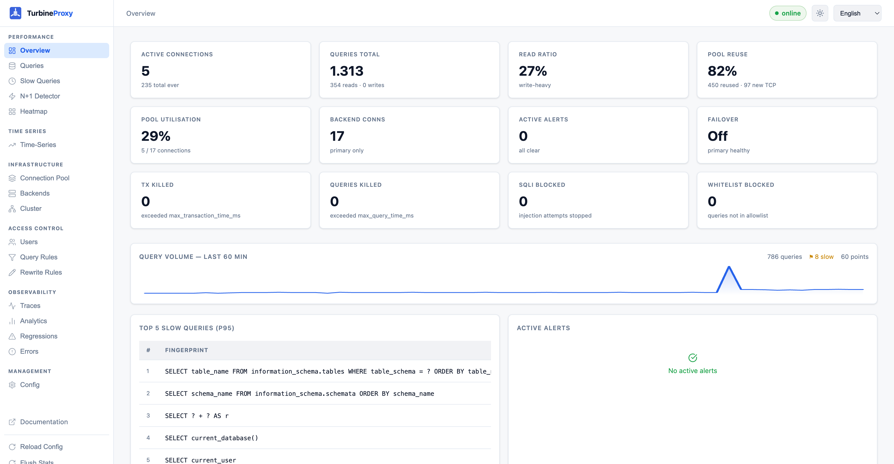

# TurbineProxy

[](https://github.com/turbineproxy/turbineproxy/actions/workflows/ci.yml)
[](https://codecov.io/gh/turbineproxy/turbineproxy)
[](https://crates.io/crates/turbineproxy)
[](LICENSE-APACHE)

**High-performance MySQL & PostgreSQL proxy** written in Rust — connection pooling, automatic read/write splitting, GTID-aware consistency guarantees, WAN compression, SQL injection protection, an embedded analytics dashboard, and an MCP server that lets AI assistants reason about your query workload in real time.

> [!WARNING]
> This project is currently under active development.
> Features, APIs, and configuration may change between releases.
> If you find bugs, regressions, or unclear behavior, please open an issue with reproduction steps.



```
Client ──TLS──▶ TurbineProxy ──TLS──▶ Primary  (writes + transactions)
                             │
                             ├──────▶ Replica 1 (reads — weighted round-robin)
                             └──────▶ Replica 2 (reads — weighted round-robin)
```

---

## Table of Contents

- [Feature Overview](#feature-overview)
- [Quick Start](#quick-start)
- [Docker](#docker)
- [Configuration](#configuration)
- [Security](#security)
- [MCP Server](#mcp-server)
- [Prometheus Metrics](#prometheus-metrics)
- [Building from Source](#building-from-source)
- [Testing](#testing)
- [Documentation](#documentation)
- [Contributing](#contributing)
- [License](#license)

---

## Feature Overview

| Category | Features |
|----------|----------|
| **Protocols** | MySQL 8.0+, MariaDB 10.6+, PostgreSQL 14+ |
| **Routing** | Auto read/write split, query rules (regex/digest/user/schema), per-rule fast-forward, hostgroup pinning, weighted round-robin, backup replicas |
| **Consistency** | Time-based RYOW, GTID-aware RYOW, sticky connections for user variables and prepared statements |
| **Pooling** | Per-backend pool, per-backend `max_connections` cap, idle eviction, multiplexing, stmt_conn isolation from tx_conn |
| **Compression** | zlib (MySQL 5.7+), zstd (MySQL 8.0.18+) on backend connections |
| **Performance** | Global & per-rule fast-forward mode (zero-overhead passthrough), per-rule QPS rate limiting (token bucket), result cache with TTL, query rewriting (LIMIT injection, timeout hints) |
| **TLS** | Frontend TLS (client → proxy), backend TLS (proxy → DB), verify-identity for RDS/Cloud SQL, NSS Key Log for debugging |
| **Security** | SQL injection protection (UNION, stacked queries, SLEEP, BENCHMARK, INTO OUTFILE, xp_cmdshell, hex evasion…), per-user rules, read-only enforcement, query allowlist, append-only audit log |
| **HA** | Health checks, lag monitoring, automatic failover, Group Replication / InnoDB Cluster awareness, Galera check, PROXY Protocol v2 (HAProxy, AWS NLB), multi-node cluster config sync |
| **Observability** | Prometheus metrics (11 metric families + histograms), Grafana dashboard JSON, query heatmap, N+1 detector, index advisor, slow query log, per-query tracer |
| **Operations** | Per-port `server_version` string, zero-downtime reload (SIGHUP / dashboard), dry-run query rules, Helm chart, Docker (distroless), AUR / deb / Homebrew packages, systemd unit, logrotate config |
| **AI / Automation** | Embedded MCP server (7 tools) for AI assistant integration |

---

## Quick Start

### One-line Install

```bash
curl -fsSL https://raw.githubusercontent.com/turbineproxy/turbineproxy/main/scripts/install.sh | sh
```

Install a specific release tag:

```bash
curl -fsSL https://raw.githubusercontent.com/turbineproxy/turbineproxy/main/scripts/install.sh | sh -s -- v0.1.0
```

### Interactive Config Wizard

```bash
turbineproxy init
turbineproxy init --output ./deploy/turbineproxy.toml
```

### Manual Setup

```bash
curl -Lo turbineproxy https://github.com/turbineproxy/turbineproxy/releases/latest/download/turbineproxy-x86_64-unknown-linux-musl
chmod +x turbineproxy
./turbineproxy --config turbineproxy.toml
# Dashboard: http://localhost:8080  MySQL: localhost:3307
```

---

## Docker

```bash
docker run -d \
  -v $(pwd)/turbineproxy.toml:/etc/turbineproxy/turbineproxy.toml:ro \
  -p 3307:3307 -p 8080:8080 \
  ghcr.io/turbineproxy/turbineproxy:latest
```

---

## Configuration

See [turbineproxy.example.toml](turbineproxy.example.toml) for the full annotated reference. A typical production setup:

```toml
[shared]
max_connections = 1000
pool_size       = 20

[shared.primary]
addr     = "db-primary:3306"
user     = "proxy"
password = "secret"
database = "myapp"

[[shared.replicas]]
addr        = "db-replica-1:3306"
user        = "proxy"
password    = "secret"
database    = "myapp"
weight      = 100
compression = "zstd"

[mysql]
enabled          = true
listen_addr      = "0.0.0.0:3307"
gtid_aware_ryow  = true

[pgsql]
enabled               = true
listen_addr           = "0.0.0.0:5432"
health_check_database = "postgres"

[frontend_tls]
enabled = true
cert    = "/etc/turbineproxy/server.crt"
key     = "/etc/turbineproxy/server.key"

[analytics]
enabled        = true
db_path        = "turbineproxy_analytics.db"
slow_query_ms  = 100
retention_days = 30

[dashboard]
enabled     = true
listen_addr = "0.0.0.0:8080"
username    = "admin"
password    = "change-me"

[ha]
enabled                    = true
health_check_interval_secs = 5
max_replica_lag_ms         = 5000
primary_failover_threshold = 3

sql_injection_protection = true
```

---

## Security

TurbineProxy applies multiple layers of protection:

### SQL Injection Detection

A built-in pattern library (`src/proxy/security.rs`) inspects every inbound query before it reaches the backend. Patterns cover:

- Classic UNION-based injection (`UNION SELECT`, `UNION ALL SELECT`)
- Stacked queries (`;` followed by DML/DDL)
- Time-delay probes (`SLEEP()`, `BENCHMARK()`, `pg_sleep()`, `WAITFOR DELAY`)
- Out-of-band extraction (`INTO OUTFILE`, `INTO DUMPFILE`, `LOAD_FILE()`)
- System command execution (`xp_cmdshell`, `exec()`)
- Encoding evasion (hex literals, `CHAR()` sequences, URL-encoded payloads)
- Boolean-based blind patterns (`1=1`, `1=0`, `'a'='a'`)
- Comment-based obfuscation (`/**/`, `-- -`, `#`)

Blocked queries return a MySQL/PostgreSQL error packet to the client and increment `turbineproxy_sqli_blocked_total`. Enable with:

```toml
sql_injection_protection = true
```

### Per-User Access Control

```toml
[[shared.users]]
name            = "app_readonly"
password        = "..."
allow_writes    = false
max_connections = 50

[[shared.users]]
name            = "app_rw"
password        = "..."
allow_writes    = true
max_connections = 200
```

Read-only enforcement is applied at the proxy level — the backend never sees the write.

### Query Allowlist

```toml
query_whitelist = [
  "SELECT * FROM users WHERE id = ?",
  "INSERT INTO events (user_id, event) VALUES (?, ?)",
]
```

### Audit Log

Append-only NDJSON log (timestamp, user, client IP, SQL, destination, duration, error). Re-opened on SIGHUP:

```toml
audit_log = "/var/log/turbineproxy/audit.log"
```

### TLS

- **Frontend (client → proxy):** `[frontend_tls]` with cert and key.
- **Backend (proxy → database):** `tls_mode` per backend (`required`, `verify-ca`, `verify-identity`). Use `verify-identity` for RDS / Cloud SQL / Aurora.
- **SSL Key Log:** NSS Key Log for Wireshark. **Debug environments only.**

```toml
[frontend_tls]
ssl_keylog_file = "/tmp/sslkeys.log"   # debug only
```

### Credential Handling

- Passwords in `turbineproxy.toml` are never logged.
- Dashboard credentials are separate from database credentials.
- SHA-1 and SHA-256 auth tokens are pre-computed at startup and cached (`auth_cache_ttl_secs`). Plaintext passwords are not held in memory after the cache is warm.

### Responsible Disclosure

Report vulnerabilities to **security@turbineproxy.com** — see [SECURITY.md](SECURITY.md). Do not open public issues for security bugs.

---

## MCP Server

The embedded MCP server exposes proxy intelligence to AI coding assistants and automation tools via JSON-RPC 2.0.

**Endpoint:** `POST /mcp` (same port as the dashboard)

**Authentication:** HTTP Basic with the same `username`/`password` as the dashboard. If no credentials are configured, the endpoint is unauthenticated — always set a password in production.

```toml
[dashboard]
enabled     = true
listen_addr = "0.0.0.0:8080"
username    = "admin"
password    = "change-me"
```

**Usage:**

```jsonc
{ "jsonrpc": "2.0", "id": 1, "method": "tools/list", "params": {} }

{
  "jsonrpc": "2.0", "id": 2,
  "method": "tools/call",
  "params": { "name": "get_slow_queries", "arguments": { "limit": 10 } }
}
```

| Tool | Key fields returned |
|------|---------------------|
| `get_pool_stats` | `primary`, `replicas[]` — idle, in_use, created, evicted |
| `get_slow_queries` | `fingerprint`, `count`, `p50_ms`, `p95_ms`, `p99_ms`, `max_ms` |
| `get_n1_candidates` | `fingerprint`, `call_count`, `distinct_params`, `pattern_score` |
| `get_index_advice` | `table`, `column`, `query_sample`, `estimated_rows`, `suggestion` |
| `get_backend_health` | `addr`, `role`, `healthy`, `lag_ms`, `consecutive_failures` |
| `get_query_rules` | `match_pattern`, `destination`, `hit_count`, `last_match_secs` |
| `get_rewrite_rules` | `match_pattern`, `operation`, `hit_count`, `last_match_secs` |

**VS Code / Claude Desktop** — add to `mcp.json` / `claude_desktop_config.json`:

```json
{
  "mcpServers": {
    "turbineproxy": { "url": "http://localhost:8080/mcp" }
  }
}
```

---

## Prometheus Metrics

`GET http://localhost:8080/metrics` — Prometheus text exposition format v0.0.4.

| Metric | Type | Labels |
|--------|------|--------|
| `turbineproxy_build_info` | gauge | `version` |
| `turbineproxy_connections_total` | counter | — |
| `turbineproxy_connections_active` | gauge | — |
| `turbineproxy_queries_total` | counter | `intent` (read/write/other) |
| `turbineproxy_query_duration_seconds` | histogram | `intent` — 11 buckets 1ms→5s |
| `turbineproxy_pool_connections` | gauge | `backend`, `role`, `state` |
| `turbineproxy_pool_connections_created_total` | counter | `backend`, `role` |
| `turbineproxy_pool_connections_evicted_total` | counter | `backend`, `role` |
| `turbineproxy_replica_lag_seconds` | gauge | `backend` |
| `turbineproxy_backend_healthy` | gauge | `backend`, `role` |
| `turbineproxy_sqli_blocked_total` | counter | — |

A pre-built Grafana dashboard JSON is at `dashboard/public/grafana/turbineproxy.json`.

---

## Building from Source

```bash
git clone https://github.com/turbineproxy/turbineproxy
cd turbineproxy
cargo build --release
# Binary: target/release/turbineproxy
```

Cross-compile for Linux musl (static binary):

```bash
cross build --release --target x86_64-unknown-linux-musl
```

---

## Testing

```bash
cargo test --bins

docker compose up mysql80 -d
cargo test --test integration_tests -- --test-threads=1

docker compose up postgres14 -d
cargo test --test pg_integration_tests -- --test-threads=1

cargo bench -- hot_path
```

---

## Documentation

Full documentation at **[docs.turbineproxy.com](https://docs.turbineproxy.com)**.

- [Getting Started](https://docs.turbineproxy.com/docs/getting-started)
- [Configuration Reference](https://docs.turbineproxy.com/docs/configuration/reference)
- [Security Guide](https://docs.turbineproxy.com/docs/features/security)
- [Dashboard & Metrics](https://docs.turbineproxy.com/docs/dashboard)
- [Migration from ProxySQL](https://docs.turbineproxy.com/docs/getting-started/from-proxysql)

---

## Contributing

See [CONTRIBUTING.md](CONTRIBUTING.md). Security issues: see [SECURITY.md](SECURITY.md).

## License

Licensed under [Apache-2.0](LICENSE-APACHE).
